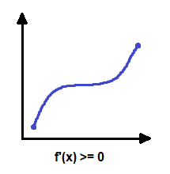

Binary search
=============

"Although the basic idea of binary search is comparatively straightforward, the
details can be suprisingly tricky" -- Donald Knuth

Basic idea
----------

Binary search can check if a target value exists in a sorted array.

.. code-block:: cpp

   int l = 0, r = n-1;
   while (l <= r) {
      int m = (l+r)/2;
      if (a[m] == target) {
         // target found at index m!
      }
      if (a[m] > target) r = m-1;
      else l = m+1;
   }

The intuition is apparent for the most part. If the middle element is too large
we chop the upper bound by r = m-1, and if the middle is too small we chop the
lower bound shifting our new middle to something larger.

The less than or equal to loop condition is important. What if we ommited
the or equal to leaving l < r?

.. code-block::

   // Let's search for 9 in [5, 7, 8, 9]
   l = 0, r = 3
      m = 1
      a[1] = 7 < 9
      l = 2
   l = 2, r = 3
      m = 2
      a[2] = 8 < 9
      l = 3
   // No! The search exits before reaching the target
   // change l < r to l <= r to finish searching
   l = 3, r = 3
      m = 3
      a[3] = 9

Details
-------

Binary search can find *closest* values by taking advantage of exit state. 
Make target = 6 and find the first element equal to 6 or greater. 

.. code-block::

   // First element greater than or equal to 6 in [5, 7, 8, 9]
   l = 0, r = 3
      m = 1
      a[1] = 7 > 6
      r = 0
   l = 0, r = 0
      m = 0
      a[0] = 5 < 6
      l = 1
   // After loop, l = 1 holds the answer

Make target 10 and find the first element equal to 10 or greater

.. code-block::

   // First element >= 10 in [5, 7, 8, 9]
   l = 0, r = 3
      m = 1
      a[1] = 7 < 10
      l = 2
   l = 2, r = 3
      m = 2
      a[2] = 8 < 10
      l = 3
   l = 3, r = 3
      m = 3
      a[3] = 9 < 10
      l = 4
   // After loop, l = 4 is out of bounds as expected

Where the value of a function changes 
-------------------------------------

Let's say we have a monotonically increasing function f(x). It is entirely
nondecreasing i.e. f'(x) >= 0 in the range of x.

We can binary search f(x) just like a sorted array. Suppose f(x) starts off
invalid and eventually becomes valid. Let's define it as ok(x).

Binary search can find the smallest value of x where ok(x) holds true. We use
the exit state just like searching for the *closest* value above. We search for
the first input element x that returns ok(x) as true.

.. code-block:: cpp

   int l = a, r = b;
   while (l <= r) {
      int m = (l+r)/2;
      if (ok(m)) {
         // valid at m, but shift left to get smallest value
         r = m-1;
      }
      else l = m+1;
   }
   // After loop, l = x holds the answer

Time complexity
^^^^^^^^^^^^^^^

Binary search this way runs in O(ok(x)) * O(logn) time. For example, if ok(x)
is O(n) the resultng runtime is O(nlogn). Normal binary search is O(logn) as 
ok(x) is O(1) because it takes constant time to check if the target is found.

Practice problems
^^^^^^^^^^^^^^^^^

* `Codeforces Round #733 (Div. 1 + Div. 2, based on VK Cup 2021 - Elimination (Engine)) C. Pursuit`_
* `Kick Start Round A 2020 Workout`_

.. _Codeforces Round #733 (Div. 1 + Div. 2, based on VK Cup 2021 - Elimination (Engine)) C. Pursuit: https://codeforces.com/contest/1530/problem/C
.. _Kick Start Round A 2020 Workout: https://codingcompetitions.withgoogle.com/kickstart/round/000000000019ffc7/00000000001d3f5b#problem 

