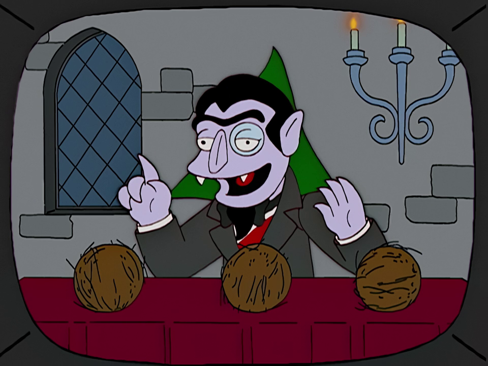

   *The Count counting coconuts*

Counting
========

A trick to counting is picturing the problem in a linear or sequential space,
like The Count's coconuts. This way, multiplying from side to side 
compartmentalizes counting steps into general expressions used for efficiently
counting without generating each case separately.

Permutations
------------

Start by counting the number of ways n elements can be ordered. 

Say n = 4

_ _ _ _

There are four elements to choose from for the first position

4 _ _ _

In the second position, three elements to choose from

4 3 _ _

And so on 

4 3 2 _

Until the last position with one element left to choose

4 3 2 1

Multiplying each stage 

4*3*2*1 = 24 ways four elements can be ordered

Generalized for n elements 

n! = n * (n - 1) * (n - 2) * ... * 1 = ways to order n elements

Combinations
------------

Many counting problems distilled are: Count the number of ways to choose k sized
subsets from a set of n elements.

Start by counting all permutations of n elements with n!. 

.. code-block::

   _ _ _ _ _ _ _ ...  permutation 1
   _ _ _ _ _ _ _ ...  permutation 2
   _ _ _ _ _ _ _ ...  ...
   _ _ _ _ _ _ _ ...  ...
         .
         .  
         .
   _ _ _ _ _ _ _ ...  permutation n!

Go through all permutations and only include the first k elements. Partition
the permutations in two sections of size k and n - k.

.. code-block::

    __k__   __n-k__
   |     | |       |
   _ _ _ _ _ _ _ ...  
   _ _ _ _ _ _ _ ...  
   _ _ _ _ _ _ _ ...  permutations [1, n!] 
   _ _ _ _ _ _ _ ...  
   _ _ _ _ _ _ _ ...  
   |_______________|
           n

We need to marginalize order; recall sets contain distinct elements (i.e.,
the order doesn't matter), and permutations are ordered sequences.

The number of k sized ordered sequences is found by dividing *out* the order from
the n - k partition. Likewise, the number of n - k sized ordered sequences is
to divide *out* the order from the k partition.

n! / (n - k)! = number of permutations of size k from a set of n elements

Divide order out the remaining partition to find the number of subsets of size
k. See how multiplying the steps in the denominator works.

n! / k!(n - k)! = number of k sized subsets from a set of n elements

Check
^^^^^

How many subsets of size n can be chosen from a set of n elements? One because
each of the n! permutations contains the same n elements.

k = n

n! / n!(n - n)! = 1

The other extreme is how many subsets of size zero can be chosen?

k = 0

n! / 0!(n - 0)! = 1

Checks out! The one subset is the empty set.

Practice problems
^^^^^^^^^^^^^^^^^

* `Educational Codeforces Round 11 D. Number of Parallelograms`_
* `Educational Codeforces Round 115 (Rated for Div. 2) D. Training Session`_
* `Codeforces Round #272 (Div. 2) B. Dreamoon and WiFi`_
* `Codeforces Round #261 (Div. 2) (Div. 2) B. Pashmak and Flowers`_

.. _Educational Codeforces Round 11 D. Number of Parallelograms: https://codeforces.com/problemset/problem/660/D
.. _Educational Codeforces Round 115 (Rated for Div. 2) D. Training Session: https://codeforces.com/problemset/problem/1598/D
.. _Codeforces Round #272 (Div. 2) B. Dreamoon and WiFi: https://codeforces.com/problemset/problem/476/B
.. _Codeforces Round #261 (Div. 2) (Div. 2) B. Pashmak and Flowers: https://codeforces.com/problemset/problem/459/B
