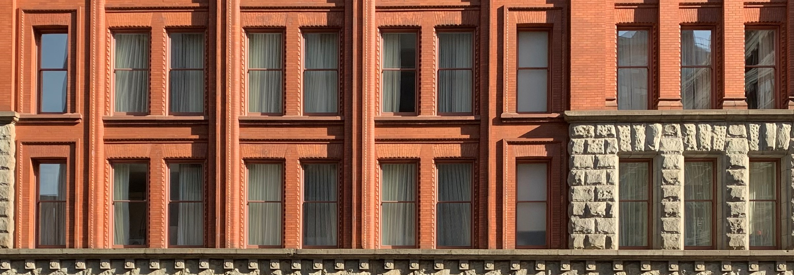
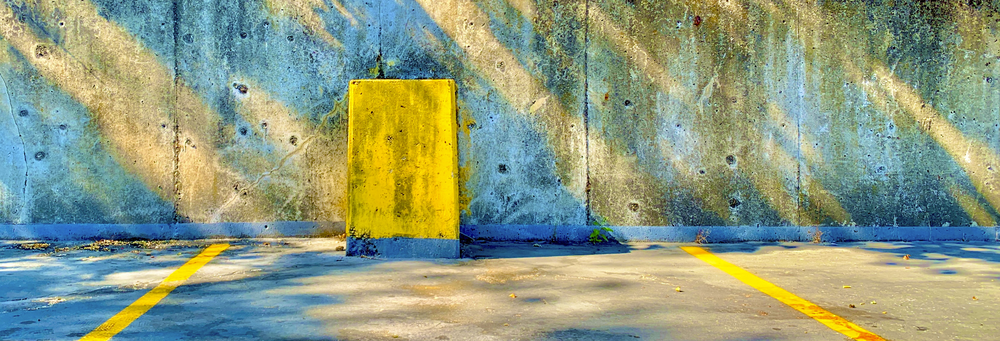
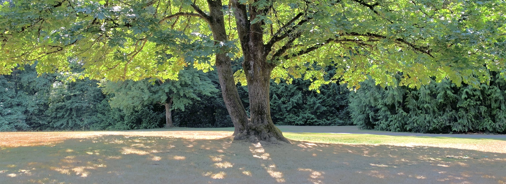
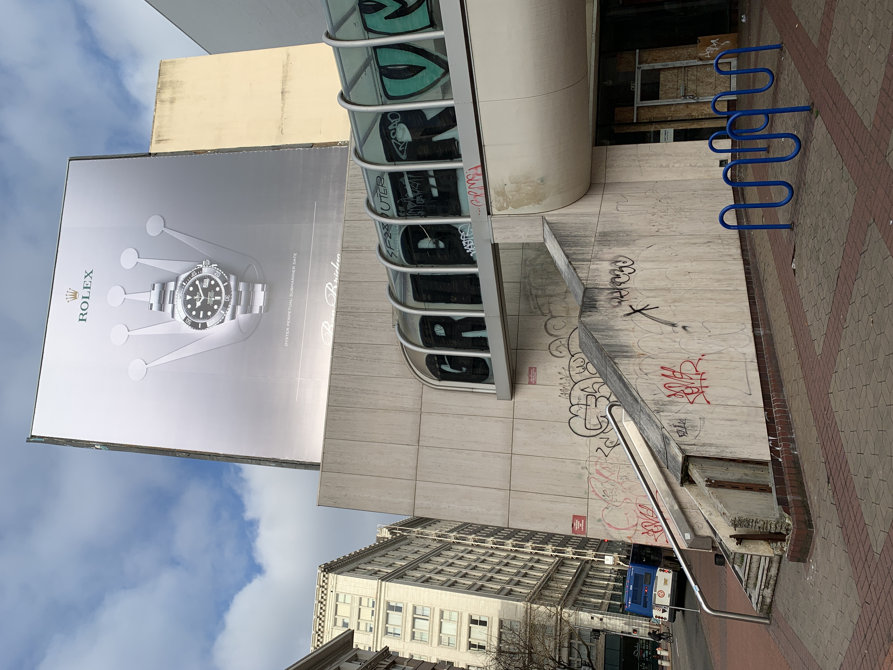
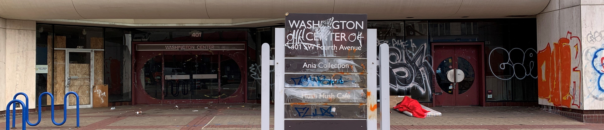
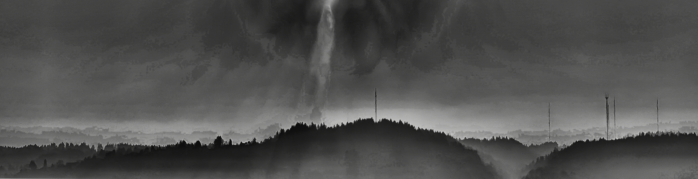
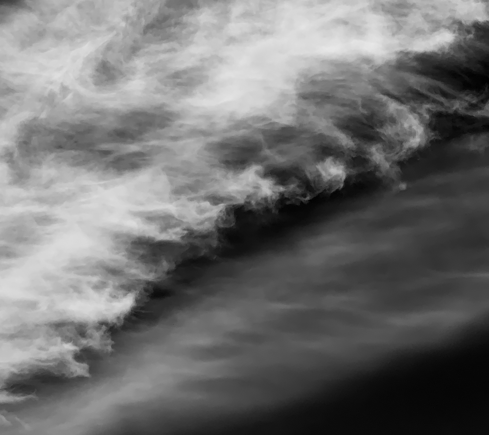
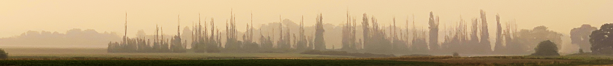
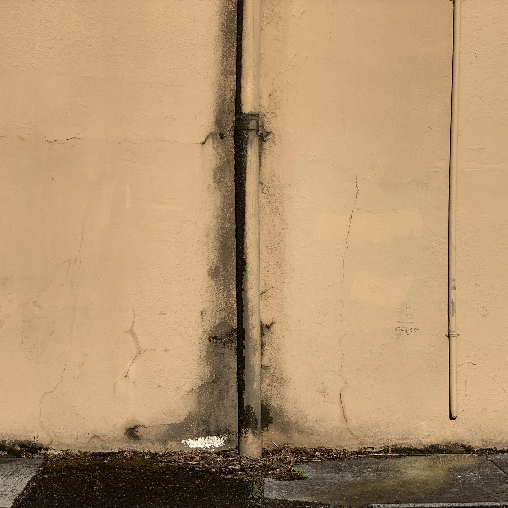

Photos
======

.. image:: _static/photos/001.jpg
   :alt: se 3rd and hawthorne on the bridge

.. image:: _static/photos/003.jpg
   :alt: fred meyer parking lot slush

.. image:: _static/photos/005.jpg
   :alt: arts center

..
   Under the curving sky
   I'm finally learning why

.. image:: _static/photos/010.jpg
   :alt: sky over village 2

To print all meta information in an image try using `exiftool <https://exiftool.org/>`_! 

.. code-block::

   exiftool -a -u -g1 a.jpg

