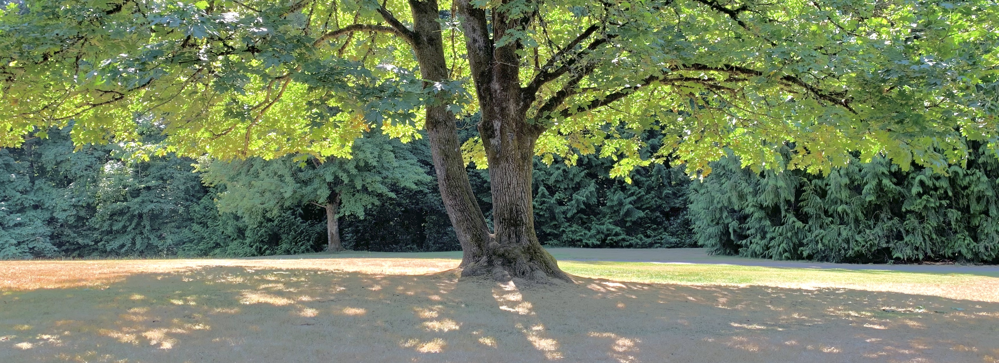
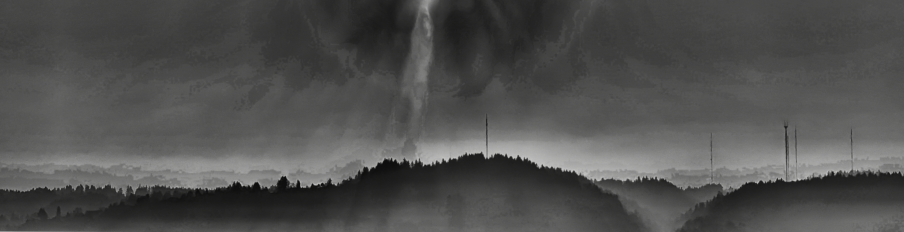
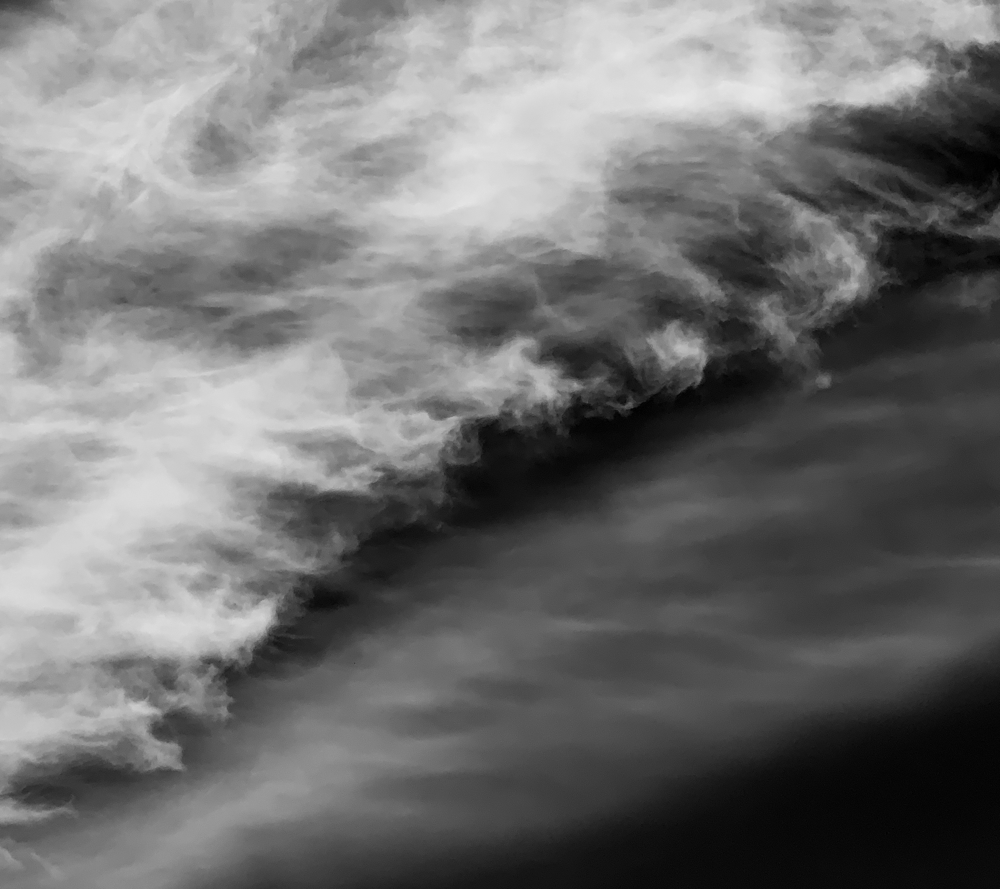
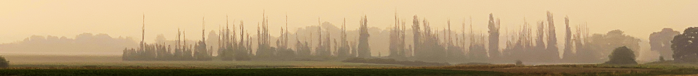
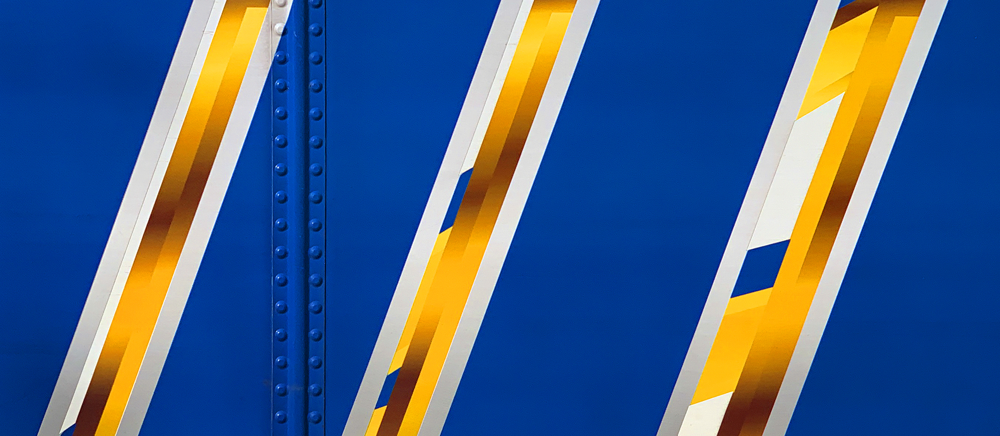

Photos
======

.. image:: _static/photos/000.jpg
.. image:: _static/photos/001.jpg
.. image:: _static/photos/002.jpg
.. image:: _static/photos/003.jpg
..
   Under the curving sky
   I'm finally learning why

..
   ruthless edit
   .. image:: _static/photos/004.jpg
   .. image:: _static/photos/005.jpg
   .. image:: _static/photos/006.jpg
   .. image:: _static/photos/007.jpg
   .. image:: _static/photos/008.jpg
   .. image:: _static/photos/009.jpg
   .. image:: _static/photos/010.jpg
   .. image:: _static/photos/011.jpg
   .. image:: _static/photos/012.jpg
   .. image:: _static/photos/014.jpg
   .. image:: _static/photos/013.jpg
   .. image:: _static/photos/016.jpg
   .. image:: _static/photos/015.jpg
   .. image:: _static/photos/021.jpg
   .. image:: _static/photos/018.jpg
   .. image:: _static/photos/019.jpg
   .. image:: _static/photos/017.jpg
   .. image:: _static/photos/022.jpg
   .. image:: _static/photos/023.jpg
   .. image:: _static/photos/026.jpg
   .. image:: _static/photos/028.jpg
   .. image:: _static/photos/029.jpg
   .. image:: _static/photos/025.jpg
   .. image:: _static/photos/032.jpg
   .. image:: _static/photos/020.jpg

..

.. image:: _static/photos/025.jpg
.. image:: _static/photos/026.jpg
.. image:: _static/photos/014.jpg

.. image:: _static/photos/004.jpg
.. image:: _static/photos/034.jpg

To print all meta information in an image try using `exiftool <https://exiftool.org/>`_! 

.. code-block::

   exiftool -a -u -g1 a.jpg

