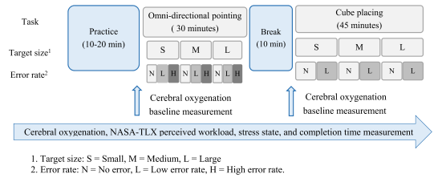
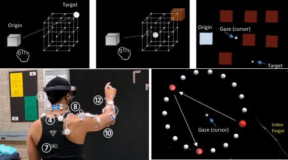
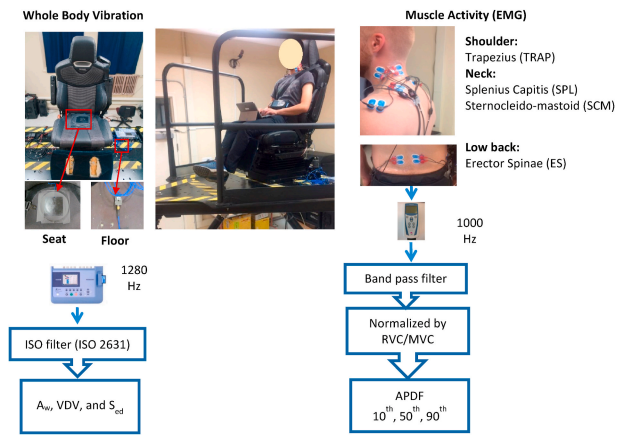
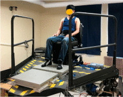
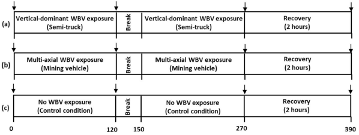

Research
========

I developed the software used in augmented reality studies conducted at the
`OEB lab <https://health.oregonstate.edu/labs/oeb>`_ and 
`WE lab <https://www.niu.edu/we-lab/>`_. Source code is linked. Code for tools used in 
other projects is not linked, but some can be found on my GitHub along with manuals. 

Papers --- augmented reality
----------------------------

*The effects of target size and error rate on the cognitive demand and stress during augmented reality interactions*
^^^^^^^^^^^^^^^^^^^^^^^^^^^^^^^^^^^^^^^^^^^^^^^^^^^^^^^^^^^^^^^^^^^^^^^^^^^^^^^^^^^^^^^^^^^^^^^^^^^^^^^^^^^^^^^^^^^^

`DOI <https://doi.org/10.1016/j.apergo.2021.103502>`_ | `source code <https://github.com/wilsjame/OEBL-error-tasks>`_

Kia, K., Hwang, J., Kim, I.-S., Ishak, H., & Kim, J. H. (2021). The effects of target size and error rate on the cognitive demand and stress during augmented reality interactions. Applied Ergonomics, 97, 103502.

Abstract
""""""""

This study investigated the effects of target size and error rate on cognitive demand during augmented reality (AR) interactions. In a repeated-measures laboratory study, twenty participants performed two AR tasks (omni-directional pointing and cube placing) with different target sizes and error rates. During the AR tasks, we measured cerebral oxygenation using functional near-infrared spectroscopy (fNIRS), perceived workload using the NASA-TLX questionnaire, stress using the Short Stress State Questionnaire, and task performance (task completion time). The results showed that the AR tasks with more interaction errors increased cerebral oxygenation, perceived workload, and task completion time while the target size significantly affected physical demand and task completion time. These results suggest that appropriate target sizes and low system errors may reduce potential cognitive demand in AR interactions.

*Evaluation of the biomechanical stress in the neck and shoulders during augmented reality interactions*
^^^^^^^^^^^^^^^^^^^^^^^^^^^^^^^^^^^^^^^^^^^^^^^^^^^^^^^^^^^^^^^^^^^^^^^^^^^^^^^^^^^^^^^^^^^^^^^^^^^^^^^^

`PDF <https://health.oregonstate.edu/sites/health.oregonstate.edu/files/kim_biomechanical_ar.pdf>`_
| `DOI <https://doi.org/10.1016/j.apergo.2020.103175>`_ | `source code <https://github.com/wilsjame/OEBL-all-tasks>`_

Kim, J. H., Ari, H., Madasu, C., & Hwang, J. (2020). Evaluation of the biomechanical stress in the neck and shoulders during augmented reality interactions. Applied Ergonomics, 88, 103175.

Abstract
""""""""

This study aimed to characterize the biomechanical stresses in the neck and shoulder, self-reported discomfort, and usability by different target distance or size during augmented reality (AR) interactions. In a repeated-measures laboratory-based study, 20 participants (10 males) performed three standardized AR tasks (3-dimensional (3-D) cube, omni-directional pointing, and web-browsing tasks) with three target distances (0.3, 0.6, and 0.9 m from each participant denoted by near, middle, far targets) for the 3-D cube and omni-directional pointing tasks or three target sizes: small (30% smaller than default), medium (default: 1.0 × 1.1 m), and large (30% larger than default) for the web-browsing task. Joint angle, joint moment, muscle activity, self-reported discomfort and comfort in the neck and shoulders; and subjective usability ratings were measured. The results showed that shoulder angle (flexion and abduction), shoulder moment (flexion), middle deltoid muscle activity significantly increased as the target distance increased during the 3-D cube task (p's < 0.001). Self-reported neck and shoulder discomfort significantly increased after completing each task (p's < 0.001). The participants preferred the near to middle distance (0.3–0.6 m) or the medium to large window size due to task easiness (p's < 0.005). The highest task performance (speed) was occurred at the near distance or the large window size during the 3-D cube and web-browsing tasks (p's < 0.001). The results indicate that AR interactions with the far target distance (close to maximum reach envelop) may increase the risk for musculoskeletal discomfort in the shoulder regions. Given the increased usability and task performance, the near to middle distance (less than 0.6 m) or the medium to large window size (greater than 1.0 × 1.1 m) would be recommended for AR interactions.

Papers --- whole body vibrations
--------------------------------

*The effects of different seat suspension types on occupants' physiologic responses and task performance: implications for autonomous and conventional vehicles*
^^^^^^^^^^^^^^^^^^^^^^^^^^^^^^^^^^^^^^^^^^^^^^^^^^^^^^^^^^^^^^^^^^^^^^^^^^^^^^^^^^^^^^^^^^^^^^^^^^^^^^^^^^^^^^^^^^^^^^^^^^^^^^^^^^^^^^^^^^^^^^^^^^^^^^^^^^^^^^^^

`DOI <https://doi.org/10.1016/j.apergo.2021.103380>`_

Kia, K., Johnson, P. W., & Kim, J. H. (2021). The effects of different seat suspension types on occupants’ physiologic responses and task performance: implications for autonomous and conventional vehicles. Applied Ergonomics, 93, 103380.

Abstract
""""""""

This study evaluated whole body vibration (WBV), non-driving task performance, muscle activity, and self-reported discomfort and motion sickness between different seat suspension systems in a simulated vehicle environment. In a repeated-measures laboratory experiment where field-measured 6-degree-of-freedom (6-DOF) passenger vehicle vibration was replicated on a 6-DOF motion platform, we measured WBV, non-driving task (pointing, typing, web-browsing, and reading) performance, low back (erector spinae), shoulders (trapezius) and neck (splenius capitis and sternocleido-mastoid) muscle activity, and self-reported discomfort and motion sickness from three different seats: a vertical (z-axis) active suspension, multi-axial active suspension [vertical (z-axis) + lateral (y-axis)], and a static suspension-less seat (current seat type in all passenger cars). Both the vertical and multi-axial active suspension seats significantly reduced the vertical WBV exposure (p < 0.0001). However, no significant differences were found in non-driving task performance (p > 0.30), muscle activity (p > 0.22), self-reported discomfort (p > 0.07), and motion sickness (p = 0.53) across three different seats. These findings indicate that the active suspension seats may have potential to future reduce the vertical and total WBV exposures, respectively. However, none of the suspension seats demonstrate any significant benefits on the non-driving task performance, muscle activity, self-reported discomfort and motion sickness measures in a simulated vehicle environment.

*Postural balance effects from exposure to multi-axial whole-body vibration in mining vehicle operation*
^^^^^^^^^^^^^^^^^^^^^^^^^^^^^^^^^^^^^^^^^^^^^^^^^^^^^^^^^^^^^^^^^^^^^^^^^^^^^^^^^^^^^^^^^^^^^^^^^^^^^^^^

`DOI <https://doi.org/10.1016/j.apergo.2020.103307>`_

Park, J.-H., Kia, K., Srinivasan, D., & Kim, J. H. (2021). Postural balance effects from exposure to multi-axial whole-body vibration in mining vehicle operation. Applied Ergonomics, 91, 103307.

Abstract
""""""""

Twenty participants (18 males and 2 females) completed postural stability assessments before and after 4-h exposure to whole body vibration (WBV) in four experimental conditions: (a) vertical-dominant WBV with vertical passive air suspension, (b) multi-axial WBV with vertical passive air suspension, (c) multi-axial WBV with multi-axial active suspension, and (d) no WBV condition. Center of pressure (COP)-based postural sway measures significantly increased following multi-axial WBV exposure. Increase in COP velocity and displacement following multi-axial WBV was significantly higher than the increase in all the other exposure conditions. However, no significant differences between the WBV conditions were observed in functional limits of stability and anticipatory postural adjustments. While our results show standing balance to be impaired following the multi-axial WBV exposure of off-road mining vehicles, dynamic stability across a broader range of conditions needs to be understood to causally link postural stability decrements to increased fall-risks associated with off-road vehicle operators.

*Effect of whole-body vibration exposures on physiological stresses: Mining heavy equipment applications*
^^^^^^^^^^^^^^^^^^^^^^^^^^^^^^^^^^^^^^^^^^^^^^^^^^^^^^^^^^^^^^^^^^^^^^^^^^^^^^^^^^^^^^^^^^^^^^^^^^^^^^^^^

`DOI <https://doi.org/10.1016/j.apergo.2020.103065>`_

Kia, K., Fitch, S. M., Newsom, S. A., & Kim, J. H. (2020). Effect of whole-body vibration exposures on physiological stresses: Mining heavy equipment applications. Applied Ergonomics, 85, 103065.

Abstract
""""""""

The aim of this study was to employ validated biological markers to quantify the physiologic consequences of exposure to whole-body vibration (WBV) and evaluate the relative impact of mining vehicle operator vibration exposure on physiological responses as compared to vertical-axial dominant WBV. In a laboratory-based study with a repeated-measures design, we played actual field-measured floor vibration profiles into a 6-degree-of-freedom motion platform to create different realistic WBV exposures: 1) vertical-dominant vibration collected from long-haul trucks, 2) multi-axial vibration collected from mining heavy equipment vehicles, and 3) no vibration (control condition). Circulating biomarkers of interest were cortisol and catecholamines (epinephrine and norepinephrine) to assess physiological stress, interleukin-6 (IL-6) and tumor necrosis factor-α (TNFα) to test for inflammation, thiobarbituric acid reactive substances (TBARS) to measure oxidative stress, and myoglobin and plasma creatine kinase to assess muscle damage. We collected blood samples at pre-exposure (0 h), during-exposure (2 and 4 h), and 2 h into recovery after the WBV exposure (6 h) in all four exposure conditions. The results showed that a single, 4-h acute exposure to WBV may not be sufficient to induce skeletal muscle damage, inflammation or physiologic stress measurable in the blood. No significant differences were observed between conditions for any of the biomarkers that could be attributed to the exposure contrast between vertical-dominant and multi-axial WBV exposures. These findings further indicate known complications of WBV exposure likely arise secondary to chronic, repeated exposures that give rise to subclinical stresses that were not captured here.
