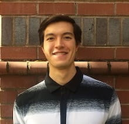

About me
========

I graduated with a BS in Mechanical Engineering from Oregon State University in 2016.
From 2016 to 2018 I worked at the `OEB lab <https://health.oregonstate.edu/labs/oeb>`_ 
as a research assistant. I completed a postbacc in Computer Science in 2018 and
continued work at the OEB lab as a software developer focused on augmented reality
applications for Microsoft's HoloLens and vibrational analysis tools.

I enjoy programming, math, reading, barbecue, and being outside with friends. 
I returned to Portland, OR in 2020 where I spend my free time working on becoming a better
`developer <https://github.com/wilsjame>`_ and `volunteering <https://www.cscoregon.org/volunteer>`_.

^_^
